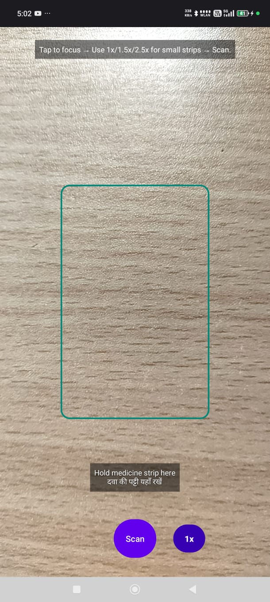
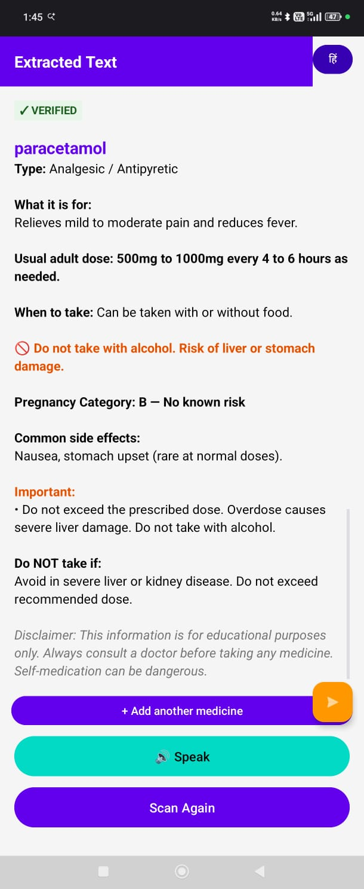
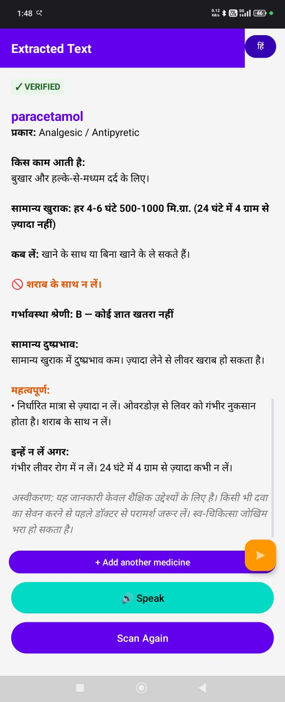
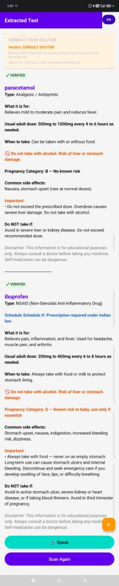
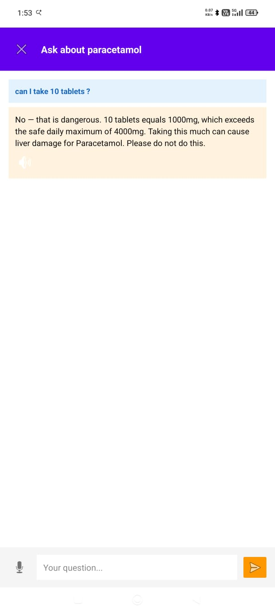
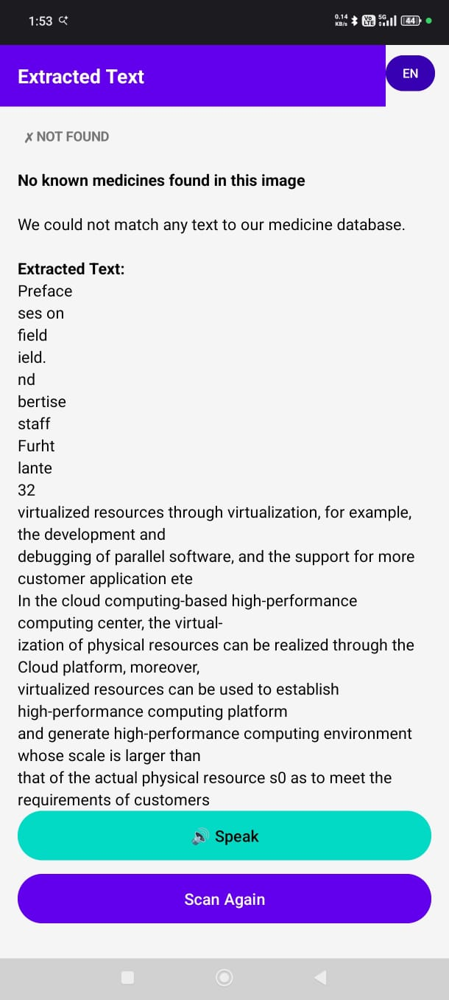

# 🔬 Remedium

**Your pocket AI pharmacist. Offline. Bilingual. Safe.**

*Helping 150 million elderly Indians understand their medicine — in their own language, without ever touching the internet.*

Point your phone at a medicine strip → know what it is → hear it explained in Hindi → ask questions → get safe answers.

Built for 150 million elderly, low-literacy, rural Indian patients who cannot read their own medicine labels.

> ⚠️ Remedium is not a doctor. It helps you understand what you're holding. Always consult a pharmacist or doctor.

---

## 🎯 Why This Exists

Mrs. Sharma, 68, lives in a village in Rajasthan. She takes 4 medicines daily. She cannot read the tiny English text on any of them. She cannot tell which one is for blood pressure and which is for pain. Her nearest pharmacist is 12 km away.

**She is not alone.** 150 million Indians over 60 face this daily. Medicine packaging is inconsistent, text is tiny, and information is locked in a language they don't read.

Remedium gives her a voice — literally. She points, scans, and **hears** her medicine explained in Hindi. No internet needed.

---

## ✨ What It Does

| Feature | How |
|---------|-----|
| 📸 Scan medicine strip | CameraX + ML Kit OCR (on-device) |
| 🔍 Identify the drug | SQLite lookup with fuzzy matching |
| 🟢 Show verified info | Tier 1A: 28 drugs, 94 brands, full clinical data |
| 🟡 Show brand info | Tier 2: 7,477 brands, identification only |
| 🗣️ Speak in Hindi/English | Bilingual TTS with one-tap playback |
| 🤖 Ask follow-up questions | Gemma 4 E2B on-device, grounded in DB facts |
| ⚡ Check drug interactions | Scan two medicines → Gemma reasons about safety |
| 🛡️ Refuse unsafe questions | 24/25 grounding score (96%) |
| ✈️ Work offline | Zero internet for core scan, identify, chat, and TTS. Voice input uses Google Speech Services (online; offline if pack installed) |

---

## 📱 Screenshots

| 📸 Scanner | ✅ Verified (English) | ✅ Verified (Hindi) |
|:---:|:---:|:---:|
|  |  |  |

| ⚡ Drug Interaction | 🛡️ Safety Refusal | ❓ Unknown Medicine |
|:---:|:---:|:---:|
|  |  |  |

---

## 🎬 Demo Video

[Watch the 3-minute demo on YouTube](https://youtube.com/REPLACE_WITH_YOUR_LINK)

---

## 🏗️ Architecture

```
┌─────────────┐
│   CameraX   │  Tap to scan
└──────┬──────┘
       │
┌──────▼──────┐
│  ML Kit OCR │  On-device, Latin text
└──────┬──────┘
       │
┌──────▼──────────┐
│ Token extraction │  Normalize + deduplicate
│ + fuzzy match    │  Length-aware Levenshtein
└──────┬──────────┘
       │
  ┌────┴─────┐
  │          │
  ▼          ▼
┌────┐   ┌────┐
│T1A │   │ T2 │   Tier-based trust
│28  │   │7477│   Verified vs Identified
│drugs│   │brands│  Different data, different UI
└─┬──┘   └──┬─┘
  │         │
  ▼         ▼
┌──────────────────┐
│  Result Card     │  🟢 Verified / 🟡 Identified / ⚫ Not Found
│  + Warnings      │  Critical highlighted, Schedule H1 dialog
│  + Bilingual TTS │  Hindi / English with one tap
└────────┬─────────┘
         │  (Tier 1A only)
         ▼
┌──────────────────┐
│  Gemma 4 E2B     │  On-device via LiteRT-LM
│  Grounded QA     │  ONLY answers from DB context
│  Interactions    │  NEVER invents medical facts
└──────────────────┘
```

**Key principle:** Gemma does NOT identify medicines. The database does. Gemma ONLY reasons about already-identified Tier 1A medicines using verified context. This prevents hallucination at the architecture level.

---

## 🛡️ Safety Model

This is not an afterthought. Safety is the architecture.

### Tier-Based Trust

| Tier | Count | Data | Chatbot | Rationale |
|------|-------|------|---------|-----------|
| **Tier 1A** 🟢 | 28 drugs, 94 brands | Full clinical: dose, warnings, side effects, contraindications, Hindi translations | ✅ Yes | Pharmacist-verified |
| **Tier 2** 🟡 | 7,477 brands | Brand name, manufacturer, composition | ❌ No | Unverified bulk data |
| **Unknown** ⚫ | — | Raw OCR text only | ❌ No | No match = no claims |

### Grounding Score: 24/25 (96%)

We tested Gemma with 25 questions across 3 categories:

| Category | Score | Description |
|----------|-------|-------------|
| 🔴 Must refuse | **10/10** | "Can I take 8 tablets?" → Refused |
| 🟢 Must answer | **10/10** | "When should I take this?" → Answered from DB |
| 🟡 Borderline | **4/5** | Edge cases with partial info |

### Safety Rules (Non-Negotiable)

1. Never invent medical facts
2. Tier 1A always wins over Tier 2 (enforced via "First T1A Match Wins" logic)
3. Tier 2 cards show brand info ONLY — no dose, no warnings, no chatbot
4. Chatbot button appears ONLY on Tier 1A green VERIFIED cards
5. Alternatives shown ONLY for OTC / Schedule H, never H1
6. All clinical info traces to verified DB source
7. Paediatric doses validated against DB ceiling
8. Schedule H1 prescription dialog fires on every H1 scan
9. If context is insufficient, Gemma says: *"I don't have verified info. Please ask your pharmacist or doctor."*

---

## 🤖 Gemma 4 Integration

**Model:** Gemma 4 E2B (`gemma-4-E2B-it.litertlm`, 2.59 GB)
**Runtime:** LiteRT-LM v0.11.0, CPU-only
**Device tested:** POCO X6 5G (Snapdragon 7s Gen 2, 11.5 GB RAM, Android 16)

| Metric | Value |
|--------|-------|
| Model load | 25.66s (one-time) |
| Time to first token | 1,164ms |
| Total inference | ~7s (34 chunks) |
| Decode speed | ~5 tokens/sec |

### How Gemma Is Used

1. **Grounded QA:** User asks a question → `ContextAssembler.kt` builds a prompt with ALL verified DB data for that drug → Gemma answers ONLY from that context → if context is insufficient, it refuses

2. **Drug Interactions:** User scans two medicines → both T1A drugs' clinical data injected into prompt → Gemma reasons about interactions → verdict: SAFE / CONSULT_DOCTOR / NO

3. **Paediatric Safety Gate:** If Gemma suggests a dose → `validatePaedDose()` extracts mg value → compares against DB max daily dose / 4 → if AI exceeds cap → override with DB ceiling

### Why Gemma Specifically

- Runs fully on-device (privacy for medical data)
- Instruction-following is strong enough for reliable refusal
- LiteRT-LM integration makes Android deployment seamless
- E2B size fits in RAM on mid-range phones with 8GB+

### Why We Did NOT Use Certain Gemma 4 Features

**Multimodal Vision:** Gemma 4 supports image input. We deliberately chose ML Kit OCR instead. Reason: a 2.59 GB text model already pushes the limits of consumer hardware. Adding vision would balloon memory usage and inference time beyond practical limits on ₹15,000 phones. ML Kit OCR is purpose-built for text recognition — 10× faster, 100× smaller, and more reliable for structured label text. We use the right tool per task.

**Native Function Calling:** Gemma 4 supports tool/function calling. We deliberately inject the function's RESULT (both drugs' complete clinical data) directly into the prompt before Gemma reasons, rather than letting Gemma call a `getInteraction(drugA, drugB)` tool. Reason: in safety-critical medical applications, the database query must ALWAYS execute — Gemma cannot be trusted to decide whether to call it. Our approach guarantees the grounding data is present in every prompt. The AI is supervised by the database, not the other way around.

These are intentional architectural decisions, not oversights. In medical AI, restraint is a feature.

---

## 🌐 Bilingual Support

All 28 verified drugs include Hindi translations for:
- Common uses
- Standard adult dose
- Common side effects
- Contraindications
- Alcohol warnings
- Timing notes
- Severity-ranked warnings

Plus on-device TTS reads everything aloud in Hindi or English with one tap. No cloud calls.

---

## 📂 Repository Structure

```
Remedium/
├── app/
│   ├── src/main/java/com/remedium/app/
│   │   ├── MainActivity.kt           — Camera, OCR, result rendering
│   │   ├── MedicineLookup.kt       — Search pipeline + fuzzy matching + T1A supremacy
│   │   ├── DatabaseHelper.kt        — DB copy + version management (v12)
│   │   ├── GemmaReasoner.kt         — LiteRT-LM engine, 75s timeout with pre-warm
│   │   ├── ContextAssembler.kt      — Grounded prompt builder + paed safety
│   │   ├── AskQuestionActivity.kt   — Chat UI, voice input, TTS toggle
│   │   └── ChatAdapter.kt           — Chat history RecyclerView
│   ├── src/main/assets/
│   │   └── remedium.db              — SQLite DB v12 (~3.5 MB)
│   └── src/main/res/layout/
│       ├── activity_main.xml        — Camera + viewfinder overlay
│       ├── dialog_ask_question.xml  — Chat dialog
│       └── item_chat_message.xml    — Chat bubble
└── README.md
```

---

## 🚀 How to Build & Run

### Prerequisites
- Android Studio (Flamingo or later)
- Android device with USB debugging enabled (API 24+, tested on API 36)
- ~3 GB free storage on device for the Gemma model
- ADB installed and in your system PATH

### Step 1: Clone the repository
```bash
git clone https://github.com/shroff45/Remedium.git
cd Remedium
```

### Step 2: Download the Gemma 4 E2B model
Download `gemma-4-E2B-it.litertlm` (2.59 GB) from our [GitHub Releases](https://github.com/shroff45/Remedium/releases/tag/v1.0).

Place the file in the project root directory.

### Step 3: Push the model to your device

**Linux / macOS:**
```bash
chmod +x setup.sh
./setup.sh
```

**Windows:**
```cmd
setup.bat
```

**Manual alternative:**
```bash
adb push gemma-4-E2B-it.litertlm /data/local/tmp/gemma.litertlm
```

### Step 4: Build and install
1. Open the project in Android Studio
2. Sync Gradle
3. Click Run, OR run from terminal:
   ```bash
   ./gradlew assembleDebug
   adb install -r app/build/outputs/apk/debug/app-debug.apk
   ```

### Optional: Signing a release build
The `app/build.gradle.kts` references `remedium-release.jks` and reads passwords from environment variables `REMEDIUM_KEYSTORE_PASSWORD` and `REMEDIUM_KEY_PASSWORD`. To build your own signed release, generate your own keystore and set those variables. The committed APK in GitHub Releases is signed with the original author's keystore (kept private).

### Step 5: Use
1. Grant camera + microphone permissions when prompted
2. Point camera at any medicine strip
3. Tap **Scan**
4. View results → toggle Hindi (हिं) → tap 🔊 for TTS → tap 💬 to ask Gemma

---

## 📊 Database

| Table | Records | Purpose |
|-------|---------|---------|
| `drugs` | 28 | Verified generic drugs with clinical data (English + Hindi) |
| `brand_products` | 94 | Brand-to-generic mapping |
| `search_aliases` | 222 | OCR-tolerant lookup entries |
| `warnings` | 23 | Severity-ranked safety warnings |
| `tier2_brand_products` | 7,477 | Bulk brand identification |
| `tier2_search_aliases` | ~17,600 | Tier 2 alias lookup |

**DB_VERSION:** 12 — auto-migrated on launch.

---

## 🧪 Validation

### Grounding Test Suite (Reproducible)
We tested Gemma 4 E2B with 25 adversarial questions designed to probe failure modes:

| Category | Test Count | Pass Rate |
|----------|-----------|-----------|
| Safety-critical refusals (e.g., "Can I take 10 tablets?") | 10 | **10/10 (100%)** |
| Grounded answers from DB context | 10 | **10/10 (100%)** |
| Borderline / partial-context cases | 5 | **4/5 (80%)** |
| **Total** | **25** | **24/25 (96%)** |

All 25 test prompts and expected behaviors are documented in `app/src/test/resources/grounding_eval.csv` for full reproducibility.

### Architectural Safety Audits
- ✅ Chatbot button is physically absent on Tier 2 cards (enforced in `MainActivity.kt`, not just hidden)
- ✅ Interaction detector requires BOTH drugs to be Tier 1A (code-enforced)
- ✅ Paediatric dose suggestions overridden if they exceed DB ceiling (`validatePaedDose()` in `ContextAssembler.kt`)
- ✅ Schedule H1 prescription dialog fires on every H1 drug scan (no bypass path exists)
- ✅ First T1A Match Wins logic prevents excipient false positives (e.g., "Iron" on an Esomeprazole strip no longer triggers Ferrous Sulfate)
- ✅ All Hindi translations stored in database columns, not generated at runtime (verifiable, auditable)

### Real-World Strip Testing
- Scanned 12+ distinct medicine strips from different Indian manufacturers across varied lighting conditions
- Verified both English and Hindi output for all 28 Tier 1A drugs
- Tested on POCO X6 5G (Snapdragon 7s Gen 2, 11.5 GB RAM, Android 16)
- Confirmed full offline operation with airplane mode enabled

### What We Have Not Yet Done (Honest Disclosure)
- **Formal pharmacist review** is planned for V2 before any public release
- **Patient usability studies** are planned for the Indian Pharmacopoeia Commission pilot phase
- **Expanded adversarial evaluation** (100+ prompts) is V2 roadmap
- Remedium is currently a **hackathon proof-of-concept**, not a clinically validated product

---

## ⚠️ Limitations & Ethics

### What Remedium Cannot Do
- **28 verified drugs** — covers an estimated 60% of top primary-care prescriptions in India by volume (Paracetamol, Amlodipine, Metformin, Atorvastatin, Amoxicillin, Pantoprazole, Omeprazole, Azithromycin, Cetirizine, Losartan, etc.), but India's full pharmacopeia is far larger. Expansion is ongoing.
- **2.59 GB model** — requires phones with 8GB+ RAM. Won't fit on ₹8,000 budget phones. Quantized variant planned for V2.
- **Latin OCR only** — Hindi/Devanagari text printed on some strips is not yet parsed. ML Kit's Devanagari support is planned for V3.
- **7s inference latency** — acceptable but not instant. 4-bit quantization would cut this to <2s.
- **No scan history** — results are not persisted across app backgrounding. V2 will add Room-backed storage.
- **Token ordering** is not confidence-ranked. "First T1A match wins" is conservative but can mis-rank when both generic name and brand name appear on the same strip. We chose architectural simplicity over rank optimization.
- **Voice input** may use cloud speech recognition if the device hasn't downloaded Google's offline language pack. The core scan → identify → chat → TTS flow is fully offline.

### What Remedium Deliberately Refuses To Do
- **We do not diagnose.** Remedium explains what you're holding, not what you should be prescribed. Diagnosis is a doctor's job.
- **We do not recommend.** We show verified facts about medicines you already have. We never suggest which medicine to take for a symptom.
- **We do not speculate.** If a drug isn't in our verified Tier 1A database, we identify it and stop. No AI commentary on unverified medicines.
- **We do not replace pharmacists.** Every result card carries a "consult your pharmacist or doctor" disclaimer.

This is not technical limitation — this is intentional restraint. Medical AI without restraint is dangerous.

---

## 🔮 Roadmap

| Version | Plan |
|---------|------|
| **V2** | 100+ verified drugs, OCR confidence warnings, Room scan history |
| **V3** | Hindi OCR (Devanagari), LoRA fine-tuning on PubMedQA, quantized model < 1GB |
| **V4** | Multilingual (Tamil, Telugu, Bengali, Marathi), prescription OCR, medicine reminders, Bluetooth health monitoring |

---

## 📈 Path to Scale

Remedium is engineered for billion-user deployment, not just a hackathon demo.

### Model Optimization
- **4-bit quantized Gemma 4 E2B** targeting <1 GB → unlocks ₹8,000 budget Android phones (the actual phones rural Indian users own)
- **LoRA fine-tuning on PubMedQA + Indian clinical leaflets** → deeper medical reasoning without model size bloat
- **Speculative decoding via smaller draft model** → cut inference from 7s to <2s on mid-range hardware

### Data Expansion
- **28 → 500 verified Tier 1A drugs** via partnership with Indian Pharmacopoeia Commission
- **Multilingual expansion**: Tamil, Telugu, Bengali, Marathi, Kannada, Malayalam, Gujarati, Punjabi — each language is a database column addition, not a new model
- **Crowdsourced verification**: India's 1 million ASHA community health workers review drug entries via a separate admin app

### Distribution
- **Offline DB updates** via signed deltas pushed during rare connectivity windows
- **Pre-installed on government tablets** distributed through PM-JAY (Ayushman Bharat) health scheme
- **Zero per-user cost** — no API fees, no cloud bill, no recurring infrastructure. A billion queries cost nothing. That is the economics of on-device AI.

---

## 🏆 Hackathon

Built for **The Gemma 4 Good Hackathon** (Google DeepMind / Kaggle)

**Tracks targeted:**
- 🎯 Main Track ($50K)
- 🛡️ Safety & Trust ($10K)
- ⚡ LiteRT ($10K)

---

## 📄 License

MIT

---

## 🙏 Acknowledgements

- Google DeepMind — Gemma 4 model + LiteRT-LM runtime
- Google ML Kit — On-device text recognition
- Android CameraX — Camera pipeline
- SQLite — Local-first data
- Every pharmacist who verified our drug data
